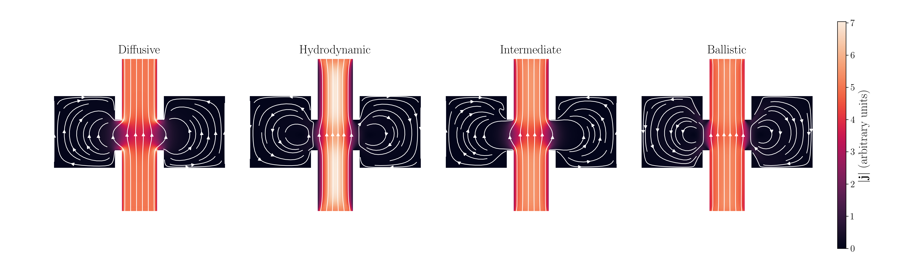

# FermiHarmonics

FermiHarmonics is a Julia code for solving a toy linearized 2D Boltzmann equation for Fermi-liquid transport, including momentum-relaxing and momentum-conserving collisions, on unstructured meshes.  It is mostly a lightweight wrapper for `Trixi.jl`, which is a library for high-order PDE solutions using Discontinous Galerkin Spectral Element Method (DGSEM).  



Documentation: <https://fermiharmonics.jackhfarrell.com>

## Quick Start

### 1. Install Julia dependencies

From the repository root:

```bash
julia --project=. -e 'using Pkg; Pkg.instantiate()'
```

### 2. Run the regime demo

Generate demo output:

```bash
julia --project=. demo/run_regime_demo.jl
```

Render the streamline figure:

```bash
python demo/plot_regime_streamlines.py
```

The figure is written to:

- `demo/streamlines.png`

## Citation
If you happen to find this code useful, it would be great if you would cite our upcoming theory/numerics paper as well as the codebase itself!

- Code release (Zenodo): `TBD`
- Theory/application paper: Farrell & Lucas (2026, to appear)

### BibTeX (Code)

```bibtex
@software{fermiharmonics_zenodo,
  author = {Farrell, Jack H.},
  title = {FermiHarmonics},
  year = {TBD},
  publisher = {Zenodo},
  doi = {TBD},
  url = {TBD}
}
```

### BibTeX (Theory Paper)

```bibtex
@article{farrellSimpleDevices2026,
  title = {Simple devices that distinguish hydrodynamic, ballistic, and diffusive transport},
  author = {Farrell, Jack H. and Lucas, Andrew},
  year = {2026},
  journal = {to appear}
}
```
