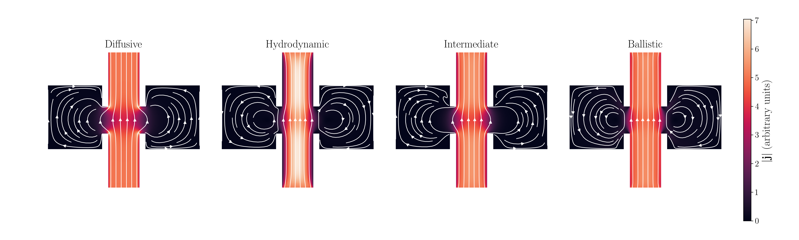

# FermiHarmonics

Linearized 2D Fermi-liquid Boltzmann transport on unstructured meshes.

FermiHarmonics is a Julia code for solving a toy linearized 2D Boltzmann equation for Fermi-liquid transport, including momentum-relaxing and momentum-conserving collisions, on unstructured meshes. In `transport=:parabolic_nonlinear` mode, the solver now combines nonlinear streaming with nonlinear BGK collision targets built from the exact drifting local-equilibrium manifold of the parabolic band. It is mostly a lightweight wrapper for `Trixi.jl`, which is a library for high-order PDE solutions using Discontinous Galerkin Spectral Element Method (DGSEM).  

[](https://doi.org/10.5281/zenodo.18528662)



Documentation: <https://fermiharmonics.jackhfarrell.com>

## Quick Start

### 1. Install Julia dependencies

From the repository root:

```bash
julia --project=. -e 'using Pkg; Pkg.instantiate()'
```

### 2. Run the regime demo

Generate demo output:

```bash
julia --project=. demo/run_regime_demo.jl
```

Render the streamline figure:

```bash
python demo/plot_regime_streamlines.py
```

The figure is written to:

- `demo/streamlines.png`

## BLG Reference Convention

For nonlinear straight-channel studies, the repository now standardizes a
dimensionless BLG-oriented reference convention while keeping the solver API
dimensionless:

- `mu0 = 1`
- `vF = 1`
- `mass = 2`
- `gamma_mr = 0`
- `gamma_mc = 0`
- straight-channel total length `L = 1`

These values are available through `FermiHarmonics.blg_reference_setup()`.
The choice `mu0 = 1` and `vF = 1` implies `mass = 2` because the nonlinear
transport model uses `vF = sqrt(2 * mu0 / mass)`.

The physical BLG effective mass `m = 0.03 m_e` is treated as part of the
back-mapping to physical units, not as a direct low-level solver input.
Exact neutrality is also outside the current nonlinear parabolic-band solver,
which requires `mu0 > 0`.

## Citation
If you happen to find this code useful, it would be great if you would cite our upcoming theory/numerics paper as well as the codebase itself!

- Code release (Zenodo): [10.5281/zenodo.18528662](https://doi.org/10.5281/zenodo.18528662)
- Theory/application paper: Farrell & Lucas (2026, to appear)

### BibTeX (Code)

```bibtex
@software{fermiharmonics_zenodo,
  author = {Farrell, Jack H.},
  title = {{FermiHarmonics}: Linearized 2D Fermi-liquid Boltzmann transport on unstructured meshes},
  year = {2026},
  publisher = {Zenodo},
  doi = {10.5281/zenodo.18528662},
  url = {https://doi.org/10.5281/zenodo.18528662}
}
```

### BibTeX (Theory Paper)

```bibtex
@article{farrellSimpleDevices2026,
  title = {Simple devices that distinguish hydrodynamic, ballistic, and diffusive transport},
  author = {Farrell, Jack H. and Lucas, Andrew},
  year = {2026},
  journal = {to appear}
}
```
